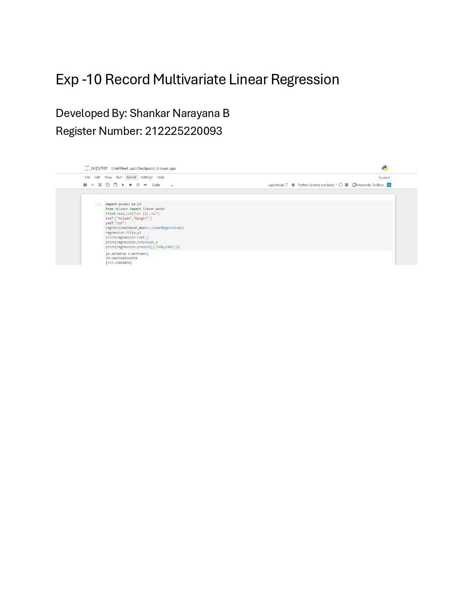

# Implementation of Multivariate Linear Regression
## Aim
To write a python program to implement multivariate linear regression and predict the output.
## Equipment’s required:
1.	Hardware – PCs
2.	Anaconda – Python 3.7 Installation / Moodle-Code Runner
## Algorithm:
### Step1
Import required libraries, load the dataset, and separate independent variables (Volume, Weight) and dependent variable (CO2).

### Step2
Create a Linear Regression model and fit the model using the training data (x, y).

### Step3
Obtain model parameters by printing coefficients and intercept.

### Step4
Use the trained model to predict CO2 emission for new input values (3300, 1300).

### Step5
Paste the given result 

## Program:
```
Developed By: Shankar Narayana B
Ref no : 212225220093


import pandas as pd
from sklearn import linear_model
df=pd.read_csv("car (1).csv")
x=df[["Volume","Weight"]]
y=df["CO2"]
regression=linear_model.LinearRegression()
regression.fit(x,y)
print(regression.coef_)
print(regression.intercept_)
print(regression.predict([[3300,1300]]))


```
## Output:



## Result
Thus the multivariate linear regression is implemented and predicted the output using python program.